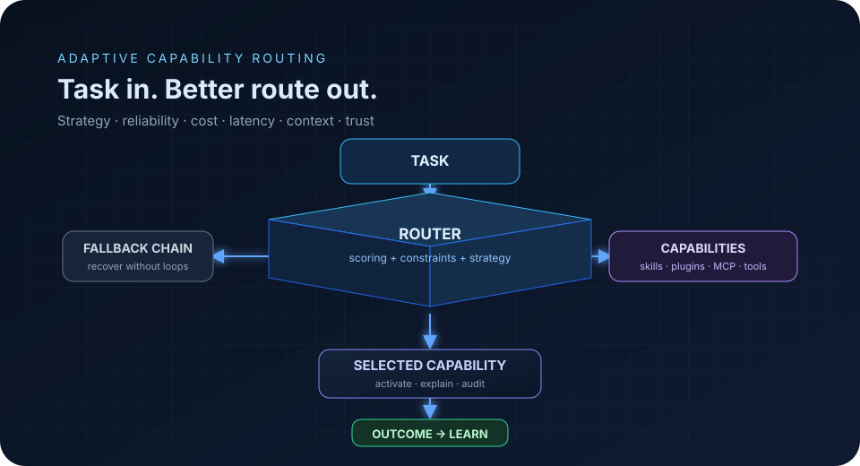
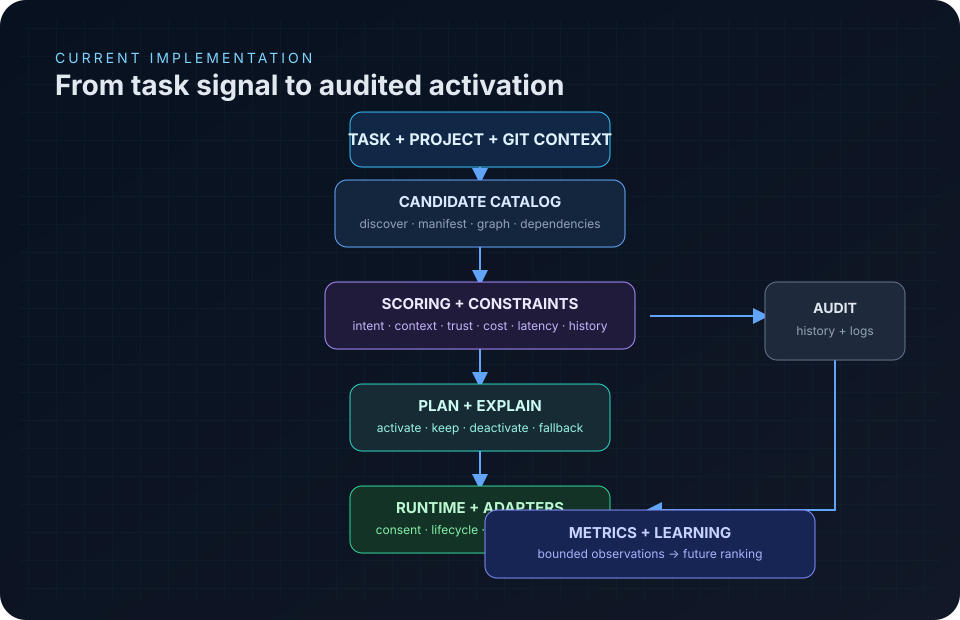
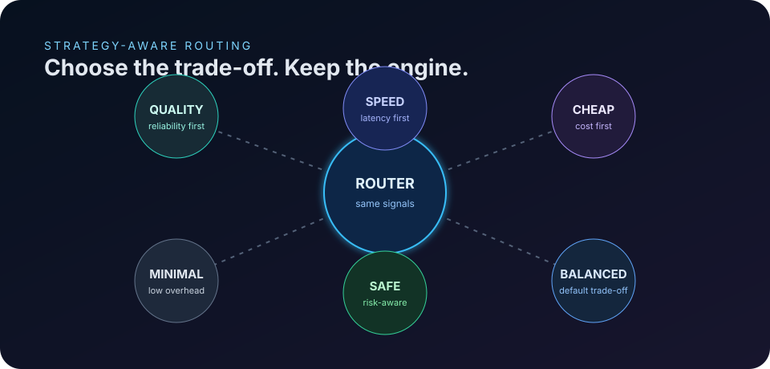
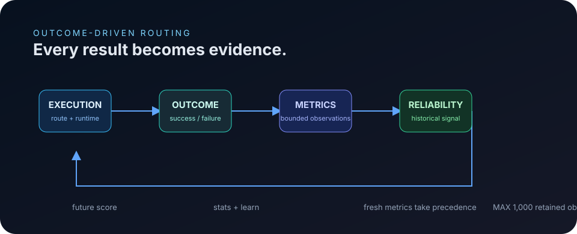
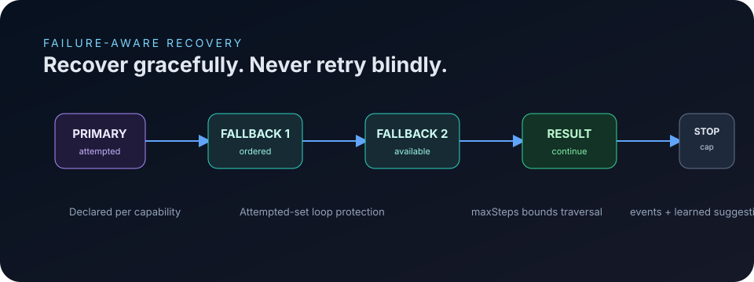
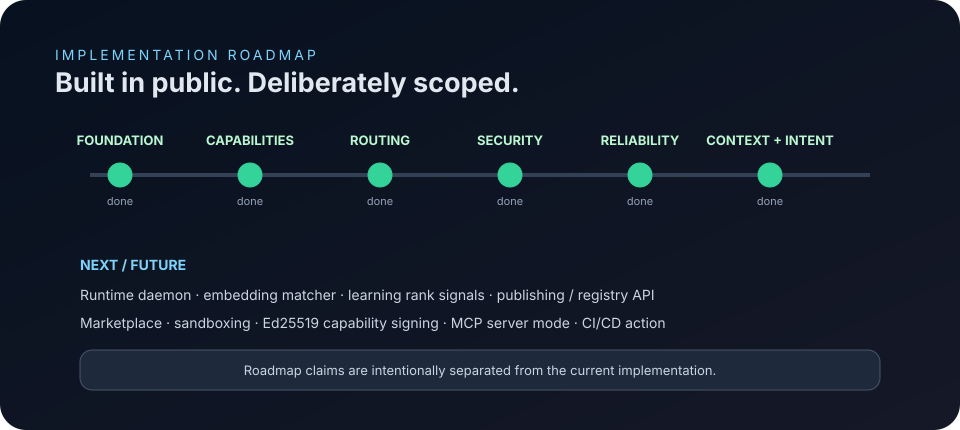

<div align="center">

# SkillRouter

### Adaptive capability routing for AI agents.

**Give every task the right capability at the right time — with context, intent, reliability, cost, latency, trust, and controlled recovery in the loop.**

[](package.json)
[](package.json)
[](LICENSE)
[](package.json)
[](https://github.com/qtjg/skillrouter/actions/workflows/ci.yml)

<br />

<a href="#quick-start">Quick start</a> ·
<a href="#how-routing-works">How it works</a> ·
<a href="#whats-built">What's built</a> ·
<a href="#roadmap">Roadmap</a>

<br /><br />



</div>

> **SkillRouter is an adaptive capability routing engine that selects the best available skill, plugin, tool, or MCP capability using capability fit, project context, intent, reliability, strategy, cost, latency, trust, and fallback behavior.**

SkillRouter is currently a local-first TypeScript CLI and routing engine. It discovers capabilities, validates manifests, analyzes the task and repository, ranks candidates deterministically, creates an activation plan, applies lifecycle changes through adapters, records audit history, and exposes the decision for inspection. The long-term direction is a broader orchestration layer; the claims below distinguish what is **implemented now** from what is **planned next**.

## Why SkillRouter exists

Most capability systems make a static choice: map a task to a hard-coded tool, activate it, and hope it works. That leaves useful evidence on the table. A repository has language, framework, dependency, filesystem, Git, runtime, and risk signals; a capability has triggers, compatibility, requirements, permissions, trust, cost, latency, and declared metadata. SkillRouter turns those signals into an explicit, inspectable routing decision instead of hiding selection inside a pile of ad-hoc conditionals.

| Static selection | SkillRouter |
| --- | --- |
| One hard-coded tool | A catalog of candidate capabilities |
| Task text only | Task, project, Git, context, intent, and constraints |
| Opaque choice | Per-factor score breakdown and explanation |
| Retry the same failure | Ordered fallback chains with loop protection |
| Declared reliability forever | Fresh outcome metrics take precedence |
| Immediate activation | Plan, risk evaluation, permission policy, consent, and audit |

## How routing works

The current pipeline is deliberately modular. The CLI bootstraps local state, refreshes the catalog, analyzes the task and project, collects normalized context, scores every candidate, resolves conflicts and dependencies, creates a plan, and lets the runtime apply that plan through connected adapters. Routing itself does not require an LLM; optional semantic and LLM interfaces can be configured without making the deterministic path dependent on them.[^routing]



### The decision path

```text
Task + project + Git context
              │
              ▼
      Candidate discovery
              │
              ▼
  Intent + context + constraints
              │
              ▼
   Strategy-aware scoring engine
              │
              ▼
 Conflict + dependency resolution
              │
              ▼
      Activation / fallback plan
              │
              ▼
 Runtime adapters + consent policy
              │
              ▼
       Audit history + outcome
              │
              └──────────► future score
```

## What's built

The repository is in **early development**, but the current implementation is substantially beyond a prototype router. The implementation tracker is the source for phase status; this summary intentionally avoids presenting roadmap items as shipped functionality.[^implementation]

| Area | Current implementation |
| --- | --- |
| Capability model | Canonical `Capability` model with `skillrouter/v1` manifest parsing, validation, normalization, metadata, dependencies, conflicts, relationships, fallbacks, permissions, risk, trust, and compatibility. |
| Catalog and lifecycle | Local and Git discovery, indexed search, install, uninstall, update, lockfile support, enable/disable, activate/deactivate, and explicit lifecycle transitions. |
| Routing engine | Deterministic matching, project analysis, Git signals, modular scoring factors, conflict resolution, dependency ordering, activation planning, dry runs, manual overrides, and explanations. |
| Context and intent | Fault-tolerant normalized context providers plus deterministic intent classification, hard constraints, permission boundaries, and soft language/framework preferences. |
| Strategies | `balanced`, `quality`, `speed`, `cheap`, `minimal`, and `safe`, with declared cost and latency metadata available to the scorer. |
| Reliability and recovery | Bounded `skill_metrics`, historical scoring, `stats`, `learn`, declared fallback chains, attempted-set loop prevention, maximum step limits, fallback events, and learned suggestions. |
| Security | Risk levels, permission declarations, untrusted-by-default policy, secret detection, trust levels, audit logging, key/signature tooling, and consent gating. |
| Adapters | OpenCode, Claude-compatible skills, generic Agent Skills, Gemini CLI, MCP configuration, and agent environment detection through `doctor`. |
| Reporting | Human-readable CLI output, JSON mode, `explain`, `verify`, `self-test`, structured logs, audit history, and static HTML dashboard export. |

## Six routing strategies

Strategies change the trade-off, not the underlying architecture. The scoring system combines matching signals with project and context evidence, trust and risk penalties, historical reliability, declared cost and latency, and the selected preset.[^scoring]



| Strategy | Optimizes for |
| --- | --- |
| `balanced` | The default general-purpose trade-off across routing signals. |
| `quality` | Stronger quality, historical, reliability, and trust signals. |
| `speed` | Lower declared latency and tighter context-cost penalties. |
| `cheap` | Lower declared cost and tighter context-cost penalties. |
| `minimal` | Lower matching overhead and lighter quality/history weighting. |
| `safe` | Stronger permission and trust penalties for risk-aware selection. |

Select a strategy per route or in `skillrouter.yaml`:

```bash
skillrouter route "migrate the database" --strategy safe
```

## Reliability that feeds routing

SkillRouter records outcomes in local `skill_metrics`. Fresh observed success rates take precedence over a capability's declared success rate; declared reliability is the final fallback when no fresher evidence exists. The observation window is bounded: once it exceeds 1,000 tasks, counters are halved so old evidence gradually matters less without allowing a small number of executions to dominate ranking.[^metrics]



The feedback loop is visible from the CLI:

```bash
# Record a successful or failed outcome.
skillrouter learn dependency-vulnerability-scanner --success --task "audit dependencies"
skillrouter learn dependency-vulnerability-scanner --failure --task "audit dependencies"

# Inspect observed reliability.
skillrouter stats
skillrouter stats --json
```

## Fallbacks without retry loops

A capability can declare an ordered `fallbacks` list. When a primary path fails, the resolver walks the declared chain, skips attempted or unavailable candidates, and stops at a bounded number of steps. Failures emit events and `learn` can suggest the next declared fallback. The result is recovery behavior that is explicit in the manifest and inspectable in the decision history.[^fallback]



## A real manifest shape

Manifests are YAML or JSON documents using the `skillrouter/v1` schema. The example below is adapted from the repository's checked-in security-auditor manifest and keeps the schema's required fields, trigger structure, compatibility, permissions, risk, context, and metadata intact.[^manifest]

```yaml
schema: skillrouter/v1
id: dependency-vulnerability-scanner
name: Dependency Vulnerability Scanner
version: 1.0.0
description: Scans project dependencies and lockfiles for known vulnerabilities.
type: skill
capabilities:
  - scan-lockfiles-for-cves
  - check-osv-advisories
triggers:
  keywords:
    - vulnerability
    - cve
    - dependency
    - lockfile
  intents:
    - "scan dependencies for vulnerabilities"
    - "check for known CVEs"
  technologies:
    - npm
    - python
compatibility:
  opencode: native
  claude: native
  gemini: adaptable
  generic: compatible
permissions:
  filesystem:
    read: true
    write: false
  network:
    allowed:
      - nvd.nist.gov
      - api.osv.dev
risk:
  level: medium
  score: 42
context:
  estimatedTokens: 2800
  activationLevel: 1
fallbacks:
  - report-writer
trust: unknown
metadata:
  author: SkillRouter Examples
  license: MIT
  categories:
    - security
    - supply-chain
```

The complete reference lives in [`docs/manifests/manifest-reference.md`](docs/manifests/manifest-reference.md), and the authoritative JSON Schema is [`schemas/skillrouter-v1.schema.json`](schemas/skillrouter-v1.schema.json).

## Route a task

The shortest useful path is a dry-run route. It refreshes the catalog, analyzes the task and project, ranks candidates, and prints the plan without changing active capabilities.

```bash
skillrouter route "write unit tests for the CLI" --dry-run
```

For machine-readable output:

```bash
skillrouter route "scan dependencies" \
  --strategy safe \
  --constraints '{"network":"forbidden"}' \
  --dry-run --json
```

The JSON route payload includes the verified decision concepts exposed by the CLI: `task`, `decisionId`, `mode`, `strategy`, `latencyMs`, `intent`, `context`, `analysis`, `activate`, `deactivate`, `contextUsage`, `dependencies`, and `dryRun`. Each activation can include `id`, `score`, `confidence`, `reasons`, and a normalized `breakdown`.[^route-cli]

A representative shape looks like this; values are illustrative, while the field names match the current implementation:

```json
{
  "task": "write unit tests for the CLI",
  "decisionId": "decision-id",
  "strategy": "balanced",
  "activate": [
    {
      "id": "testing-capability",
      "score": 84,
      "confidence": "high",
      "reasons": ["matched technology term(s): typescript"],
      "breakdown": {
        "keyword": 12,
        "technology": 14,
        "historical": 8,
        "permissionCost": -2
      }
    }
  ],
  "dryRun": true
}
```

To understand why the latest decision was made:

```bash
skillrouter explain
skillrouter explain --json
```

## CLI surface

SkillRouter is shipped as a single CLI. Use `skillrouter --help` for the complete command-specific options; the grouped surface below mirrors the command registry in `src/cli/index.ts`.[^cli]

| Group | Commands |
| --- | --- |
| Setup | `init`, `doctor`, `status`, `config` |
| Catalog | `search`, `find`, `info`, `install`, `uninstall`, `update`, `source` |
| Lifecycle | `enable`, `disable`, `force-enable`, `force-disable`, `activate`, `deactivate`, `active` |
| Routing | `route`, `explain`, `context`, `classify` |
| Security | `scan`, `permissions`, `trust`, `trust-check`, `keys`, `sign`, `signatures` |
| Observability | `logs`, `audit`, `stats`, `learn`, `verify`, `self-test`, `export` |

## Quick start

SkillRouter currently installs from source. Node.js **22.5 or newer** is required because the project uses `node:sqlite`, the built-in test runner, and native TypeScript execution; Node 24 or Node 22.18+ is recommended for stable type stripping.[^package]

```bash
git clone https://github.com/qtjg/skillrouter.git
cd skillrouter
npm install
npm run typecheck
npm run build
```

Initialize and inspect a project:

```bash
# Create project configuration and local state.
node --experimental-transform-types src/cli/index.ts init
node --experimental-transform-types src/cli/index.ts doctor
node --experimental-transform-types src/cli/index.ts status
```

After building, the package exposes the `skillrouter` binary through `bin/skillrouter.js`. Run the first route in dry-run mode before allowing activation:

```bash
npm run build
./bin/skillrouter route "write unit tests for the CLI" --dry-run
./bin/skillrouter explain
```

On Node.js **22.18+ or Node 24**, plain execution is supported. On older 22.x releases, use `--experimental-transform-types` for direct source execution.[^contributing]

## Repository architecture

The source tree is divided by domain so routing policy, capability lifecycle, adapters, storage, and security remain replaceable boundaries rather than one monolithic command implementation.

```text
src/
├── adapters/       agent integrations and environment detection
├── cli/            command registry and command handlers
├── config/         global/project configuration
├── constraints/    hard constraints and soft preferences
├── context/        normalized context collection
├── core/           types, lifecycle, ids, and events
├── graph/          capability relationships and traversal
├── intent/         deterministic task intent classification
├── learning/       bounded outcome metrics
├── manifest/       parsing, validation, normalization
├── registry/       discovery, indexing, search, and sources
├── router/         analysis, factors, planning, conflicts, fallbacks
├── runtime/        consent-gated activation and deactivation
├── security/       risk, permissions, secrets, trust, signing, audit
├── storage/        SQLite-backed replaceable storage interface
└── verify/         project and capability verification
```

The project uses a small runtime dependency surface: `yaml` plus Node built-ins. Local state is stored behind a replaceable storage interface using `node:sqlite`; project configuration is YAML, and routing state can be locked in `skillrouter.lock`.[^package]

<details>
<summary><strong>How scoring works</strong></summary>

Each candidate receives a weighted score that is clamped to the `0–100` range. Signals include task keywords and technologies, project language/framework/dependencies, Git and file patterns, compatibility, trust, quality, intent, context requirements, historical success, declared cost and latency, context cost, permission cost, and constraint preferences. Blocked candidates are removed; conflicts keep the higher-scoring candidate, with lower risk breaking ties. The normalized `scoreBreakdownV2` is exposed in route JSON for inspection.[^scoring]

</details>

<details>
<summary><strong>How context and intent work</strong></summary>

Context providers collect normalized project, Git, runtime, filesystem, package-manager, and environment signals with per-provider timeouts and secret redaction. The intent classifier is deterministic and reports the inferred intent, confidence, domain, language, signals, and operations. Route constraints can hard-reject candidates, enforce permission boundaries, require capabilities, and apply soft language/framework preferences.[^intent]

</details>

<details>
<summary><strong>How runtime safety works</strong></summary>

The router proposes a plan; the runtime applies it. Before activation, SkillRouter computes risk, constructs permission requests, evaluates policy, and asks for consent when required. Agents are updated through adapters, lifecycle transitions are enforced, and actions are recorded in the audit log. `manual` mode remains dry-run only; `assisted` mode is the default interactive path, while `automatic` and `autonomous` modes can apply plans according to configuration.[^routing] [^security]

</details>

<details>
<summary><strong>How fallback and learning work</strong></summary>

Fallback chains are declared per capability and resolved in order. The resolver skips already-attempted, unavailable, unknown, or over-limit candidates. `skillrouter learn <capability> --success|--failure` records observations, emits typed events, and can recommend a declared fallback after failure. `skillrouter stats` exposes the stored metrics in table or JSON form.[^fallback] [^metrics]

</details>

## Roadmap

The current implementation has moved through foundation, capability management, routing, adapters, security, CLI, reliability, context, and intent milestones. The next layer is broader orchestration, not a claim that those features already exist.



### Current

`skillrouter/v1` manifests, capability graph traversal, context collection, deterministic intent classification, constraints, strategy-aware scoring, fallback chains, bounded metrics, lifecycle runtime, adapters, security policy, audit logging, CLI reporting, and static dashboard export are implemented to the extent tracked in [`IMPLEMENTATION.md`](IMPLEMENTATION.md).

### Planned

The documented future direction includes a runtime daemon, embedding-based semantic matching, ranking signals built from history, publishing and registry APIs, a marketplace, sandboxing, Ed25519 capability signing, MCP server mode, CI/CD integration, cookbook skills, and a routing timeline view. These are roadmap items, not current README promises.[^implementation]

## Development and testing

Clone the repository, install dependencies, and keep strict TypeScript checks clean before opening a pull request. The project follows Conventional Commits and intentionally keeps runtime dependencies minimal.[^contributing]

Every push and pull request targeting `main` is verified by [`.github/workflows/ci.yml`](.github/workflows/ci.yml), which installs dependencies with `npm ci`, runs the TypeScript typecheck and test suite, and builds the project on Node.js 22.

```bash
npm install
npm run typecheck
npm test
npm run build
```

Focused checks are available when working in a specific area:

```bash
npm run test:unit
npm run test:router
npm run test:cli
npm run test:security
npm run test:adapters
npm run doctor
```

The README redesign was validated against the repository at commit `cf5db4c`: the full suite passed with **151 tests**, `npm run typecheck` passed, and `npm run build` passed. Those results describe this documentation audit environment, not a permanent CI badge.

## Contributing

Please read [`CONTRIBUTING.md`](CONTRIBUTING.md) before making changes. In brief: fork or clone the repository, create a focused branch, preserve strict TypeScript boundaries, add or update tests, run typecheck and the relevant verification commands, document architectural decisions in [`DECISIONS.md`](DECISIONS.md), and open a pull request with a clear explanation of the change.

Security reports should follow [`SECURITY.md`](SECURITY.md) rather than being opened as public issues.

## License

SkillRouter is released under the [MIT License](LICENSE). Copyright © 2026 Mayank Bhaskar.

## References

[^routing]: [`docs/routing/how-routing-works.md`](docs/routing/how-routing-works.md) — the verified routing pipeline, runtime flow, lifecycle states, and recording behavior.
[^implementation]: [`IMPLEMENTATION.md`](IMPLEMENTATION.md) — the repository's implementation tracker and future-work boundary.
[^scoring]: [`docs/routing/scoring.md`](docs/routing/scoring.md) — scoring factors, strategy presets, normalized breakdowns, and risk-floor behavior.
[^metrics]: [`src/learning/metrics.ts`](src/learning/metrics.ts) — bounded observations, reliability estimates, and the metrics recording engine.
[^fallback]: [`src/router/fallback.ts`](src/router/fallback.ts) and [`src/cli/commands/learn.ts`](src/cli/commands/learn.ts) — fallback resolution and outcome recording.
[^manifest]: [`docs/manifests/manifest-reference.md`](docs/manifests/manifest-reference.md) and [`examples/manifests/security-auditor.yaml`](examples/manifests/security-auditor.yaml) — manifest schema and a checked-in example.
[^route-cli]: [`src/cli/commands/route.ts`](src/cli/commands/route.ts) — route command flags and JSON payload fields.
[^cli]: [`src/cli/index.ts`](src/cli/index.ts) — the registered command surface.
[^package]: [`package.json`](package.json) — package version, Node engine, scripts, dependencies, and binary entry point.
[^contributing]: [`CONTRIBUTING.md`](CONTRIBUTING.md) — supported Node execution modes and contribution checks.
[^intent]: [`docs/routing/intent-constraints.md`](docs/routing/intent-constraints.md) — deterministic intent and constraint behavior.
[^security]: [`docs/security/security-model.md`](docs/security/security-model.md) and [`src/security/policy.ts`](src/security/policy.ts) — security model and consent policy.
